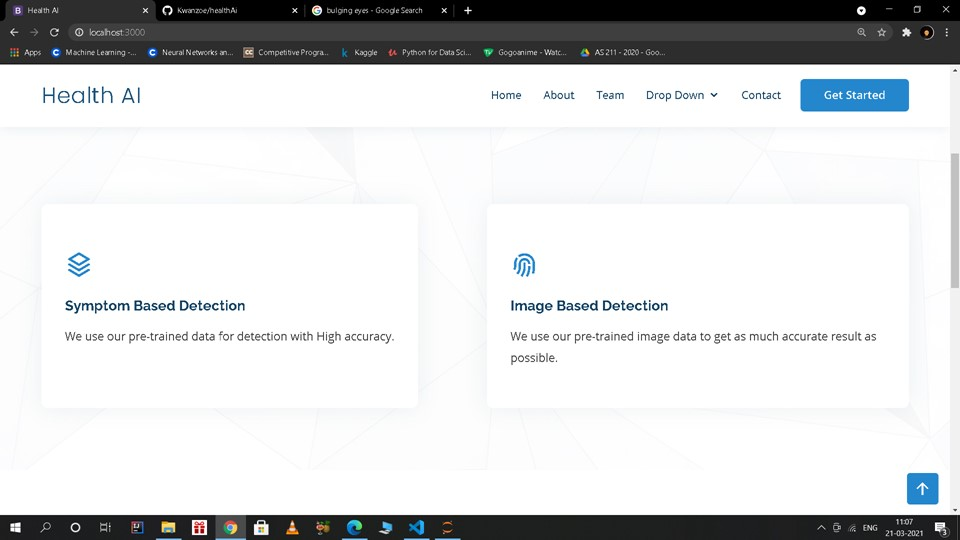

# Health AI 
Health AI is an integrated platform for  multipurpose assistance in the field of healthcare. The idea is to build a platform that provides facilities like disease predictions based on symptoms or images.

> Home Page - Health AI

## Symptom Based Detection

The symptoms based disease detection feature has more than hundred symptoms that the user can choose as input. Using the inputs from the user the machine learning models predicts the disease along with the confidence score. 
- #### Screenshots : 

> Input - Symptom Based Detection

> Output - Symptom Based Detection

## Image Based Detection

The Image based eye disease detection feature lets the user upload images of the patients eyes and then it classify the image as a disease that the patient may be suffering from.

- #### Screenshots : 

> Input - Image Based Detection

> Output - Image Based Detection

## Node.js Server Gateway

The server is the main connection and gateway between the python scripts and the front-end. It uses JS libraries and frameworks to transfer data between the clients
and the scripts.

## Project Related Links 
1) PPT Presentation - https://drive.google.com/file/d/1K-XO1x4bwnrQNfZCAhZnmkDRQvb79yGv/view?usp=sharing
2) Git Hub Link - https://github.com/deka014/healthAi

## Contributing

Pull requests and issues are more than welcome.
